# **Matplot++**

Data visualization can help programmers and scientists identify trends in their data and efficiently communicate these results with their peers.

Modern C++ is being used for a variety of scientific applications, and this environment can benefit considerably from graphics libraries that attend the typical design goals toward scientific data visualization.

Besides the option of exporting results to other environments, the customary alternatives in C++ are either non-dedicated libraries that depend on existing user interfaces or bindings to other languages.

**Matplot++** is a graphics library for data visualization that provides interactive plotting, means for exporting plots in high-quality formats for scientific publications, a compact syntax consistent with similar libraries, dozens of plot categories with specialized algorithms, multiple coding styles, and supports generic backends.

Table of Contents
=================

* [Introduction](#introduction)
* [Data Visualization in C++](#data-visualization-in-c)
  * [Data Visualization](#data-visualization)
  * [Scientific Computing in C++](#scientific-computing-in-c)
  * [Alternatives for Data Visualization in C++](#alternatives-for-data-visualization-in-c)
     * [Bindings](#bindings)
     * [Exporting Data](#exporting-data)
     * [Plotting widgets](#plotting-widgets)
     * [Gnuplot Pipes](#gnuplot-pipes)
* [The <strong>Matplot  </strong> library](#the-matplot-library)
* [Figures and Axes](#figures-and-axes)
* [Plot Categories](#plot-categories)
  * [Line Plots](#line-plots)
  * [Data Distribution](#data-distribution)
  * [Discrete Data](#discrete-data)
  * [Geography](#geography)
  * [Polar Plots](#polar-plots)
  * [Contour Plots](#contour-plots)
  * [Vector Fields](#vector-fields)
  * [Surfaces](#surfaces)
  * [Graphs](#graphs)
  * [Images](#images)
  * [Annotations](#annotations)
  * [Appearance](#appearance)
* [Coding Styles](#coding-styles)
  * [Member vs. Free-standing Functions](#member-vs-free-standing-functions)
  * [Reactive figures](#reactive-figures)
  * [Method Chaining](#method-chaining)
  * [Ranges](#ranges)
  * [Utilities](#utilities)
* [Backend Interface](#backend-interface)
* [Examples](#examples)
  * [Interface](#interface)
  * [A Minimal Application](#a-minimal-application)
  * [Applications Managing Plot Handles](#applications-managing-plot-handles)
  * [Exporting Figures](#exporting-figures)
  * [Creating new plot types](#creating-new-plot-types)
  * [Backends](#backends)
  * [Performance](#performance)
* [Conclusion](#conclusion)
* [References](#references)


# Introduction 

Data visualization is fundamental to scientific computing and metrics-driven development. Programmers can use interactive plotting to monitor their quality metrics more efficiently. Scientists rely on these tools to export their graphics in high-quality formats for scientific writings. The process of generating these graphics cannot be more expensive in terms of development time than the resources spent on the main problem at hand (Section [Data Visualization](#data-visualization)). While C++ has been valuable for a variety of scientific problems (Section [Scientific Computing in C++](#scientific-computing-in-c)), there is currently no alternative for data visualization that attends the design goals we habitually expect from scientific libraries (Section [Alternatives for Data Visualization in C++](#alternatives-for-data-visualization-in-c)). 

For this reason, this article presents **Matplot++** (Section [The Matplot++ Library](#the-matplot-library)), a graphics library for data visualization in C++. The library maintains a high-level hierarchical structure to manage plots the user can create transparently with single function calls.

The main library objects represent figures and axes that can hierarchically store child objects that can collectively represent plots in many categories (Section [Figures and Axes](#figures-and-axes)). Each plot category includes algorithms to solve numerous hurdles demanded in data visualization (Section [Plot Categories](#plot-categories)). For instance, producing plots might involve calculating multi-dimensional histogram bins, generating word clouds, efficiently cropping maps, converting data between coordinate systems, identifying contour lines, producing network layouts, and applying filters to images.

Like present libraries for different programming languages, **Matplot++** allows flexible coding styles (Section [Coding Styles](#coding-styles)). The user can choose between object-oriented programming or free-standing functions (Section [Member vs. Free-Standing Functions](#member-vs-free-standing-functions)), reactive or quiet figures (Section [Reactive Figures](#reactive-figures)), method chaining or smart pointers to adjust plot properties (Section [Method Chaining](#method-chaining)), and use any convertible range data type as input for the algorithms (Section [Ranges](#ranges)). **Matplot++** also includes simple convenience functions to manipulate data (Section [Utilities](#utilities)) and the backend interface makes it viable to use **Matplot++** in countless contexts (Section [Backend Interface](#backend-interface)).

In Section [Examples](#examples), we examine how **Matplot++** relates to other comparable libraries and environments by addressing its interface (Section [Interface](#interface)), provide extra examples of intricate integration into existent applications (Sections [Minimal Application](#a-minimal-application) and [Applications Managing Plot Handles](#applications-managing-plot-handles)), illustrate the results for varying image formats (Sections [Exporting Data](#exporting-data)), and consider more high-level practices, like conceiving novel plot categories (Section [Creating New Plot Categories](#creating-new-plot-types)) and backends for unique environments (Section [Backends](#backends)). 

# Data Visualization in C++

## Data Visualization

Data visualization can help us promptly recognize trends in data. It is an indispensable means to interpret large volumes of data and to watch high-performance applications. Besides tests and benchmarks, data visualization also enables programmers to benefit more effectively from metrics-driven development. These metrics are particularly critical for high-performance computing, where unit tests can only identify bugs in scenarios we know about. Also, benchmarks cannot ordinarily identify bottlenecks for code optimization that replicate the production environment and its edge cases. It is ineffective to work to improve systems without proper instruments to measure their performance.

For these purposes, tools for data experts usually incorporate functions for graphics. The design goals of these libraries tend to revolve around three aims:

* Interactive plotting: plots usually comprise reactive objects that get refreshed as soon as the figure attributes change. These reactive objects are valuable for monitoring systems in real-time.
* Exporting tools: libraries should have the means to export images in high-quality formats to communicate results in scientific writings.
* Productivity: the interface should incorporate commands to instantly produce the most well-known varieties of plots with a single function call.

Additional commands should be required solely to attach supplementary plots to a figure or to customize plot features. Programmers should not spend substantial development time to produce plots. The development cost of including plots should be near zero. Matplotlib had the philosophy that it should take as few commands as possible to generate a plot. If feasible, that would be only one command. For instance, one should be able to create a line plot from `x` and `y` by

```python
plt.plot(x,y)
```

The Matlab environment embeds one of these graphic libraries. It incorporates a comfortable interface to interactively update plots and generate high-quality graphics for publications. Since then, this is one of the peculiarities that made Matlab a highly valuable environment for data analysis. Many scientists and programmers export their data to Matlab to adopt it as a mechanism for generating publication-quality images.

Likewise, Octave incorporates a similar syntax for the equivalent kinds of graphics. The earliest versions of Octave used Gnuplot as a backend for its graphics. Since then, it has transitioned to a backend based on FLTK. Julia is yet another programming language that combines data visualization as part of its standard libraries.

Meanwhile, Python has increasingly matured as a powerful means for data analysis, with libraries such as Pandas and Numpy. Python provides a compromise between abstraction and performance by transparently integrating high-performance compiled code.

In this context, Matplotlib became a dominant tool that satisfied the demand for a Python graphics library. Matplotlib has a syntax comparable to the Matlab graphics library, which simplifies the transition from Matlab to Python for data scientists. Matplotlib  incorporates functions to plot anything directly on an `Axes` object. Differently from Matlab, though, Matplotlib supports two coding styles. The first coding style uses the object-oriented class methods while the second is a wrapper around these objects to make the plots available as free-standing functions. The object-oriented style is more natural to Python programmers. Given an `Axes` object `ax`, one can create a line plot from `x` and `y` by

```python
ax->plot(x,y)
```

The second coding style is designed to emulate the Matlab environment for transitioning users. In the first versions of Matplotlib, barrett2005matplotlib had a major express plan to conceive an interface as similar as possible to Matlab.

## Scientific Computing in C++

Since C++11, often referred to as Modern C++, C++ has become a very useful language for scientific computing. Features such as functional programming, type inference, constant expressions, structured binding declarations, ranges, concepts, smart pointers, variant types, and move semantics enabled C++ to catch up with most high-level programming languages. At the same time, C++ was capable of implementing these innovations without dropping its zero-overhead principle, which makes high-performance code expedient.

There are several compelling reasons to use C++ in scientific computing:

* Performance: scientific applications that rely on approximations through iterative heuristics tend to benefit the greatest from C++.
* Numeric libraries: there are many reliable numeric libraries available for C++.
* Integration: it is accessible to integrate C++ libraries into other languages and tools.
* Licenses: there is no necessity of special licenses, like in Matlab
* Bindings: one can always call their C++ code from Python, Matlab, or R, for instance.
* Distribution: if you intend to distribute your compiled code, high-performance machine code circumvents the necessity of creating prototypes in one programming language and then repeating all the work once your experiments are successful.


In parallel with the rising notoriety of Python, it has also become very prevalent the address the most computationally expensive pieces of a Python project in C++. A representative illustration of this strategy is the TensorFlow library. Modern libraries, such as PyBind11, expedite the generation of bindings connecting the two languages, making it easy for C++ programmers to provide performance to libraries in other programming languages.

Although the C++ compilation process is how it accomplishes its performance, it might be oftentimes inconvenient to data scientists, who want to smoothly experiment with data more dynamically. An intermediary solution in this regard is CERN's ROOT data analysis framework, which provides Cling, a C++ interpreter. Another option to alleviate this obstacle is to maintain smaller shared libraries with a build tool, which makes the compilation process greatly faster.

The absence of a cross-platform building system used to be a limitation of C++ over other languages for scientific computing. However, various recent C++ projects are based on CMake, which is a set of tools for building platform and compiler independent software. With the broad adoption of CMake, projects can be easily rebuilt on different platforms. By combining CMake and Emscripten, zakai2011emscripten makes it possible to even run high-performance C++ on the web with near-native speed. Some popular IDEs, such as CLion and Cevelop, use CMake as a standard format for its C++ projects.

Package-management systems are likewise a relevant component of scientific programming, as it allows programmers to quickly experiment with combinations of algorithms. The typical solution to share libraries in C++ used to be header-only libraries, which do not need to be separately compiled. Most packages in the Boost libraries are header-only and work well with the C++ standard library. However, header-only libraries lead to longer compilation times and large libraries, such as Boost, might include too many unnecessary dependencies in our projects.

An alternative to header-only libraries has been incorporated into CMake. CMake introduces commands such as `ExternalProject` and `FetchContent` to add custom targets to a project. These commands can download subprojects from usual URLs or Git repositories. If the external project is header-only or also based on CMake, the integration is particularly straightforward. Some packages, such as CPM.cmake, extend these features to provide light dependency management to C++ projects. Other packages, such as Conan and Hunter, provide more elaborate package managers. Finally, C++20 offers a feature for modules, which overcome the constraints of header files and make it more accessible to provide packages to existing projects.

The standard library in Modern C++ offers many data structures based on templates with minimal computational overhead. This is an extra opportunity for data scientists to optimize their code in styles that are impractical in more simplistic high-level languages. For instance, while Matlab is extremely comfortable for matrix operations, it might become quite inconvenient for projects whose performance depends profoundly on more distinct data structures.

There are innumerable C++ libraries for Graphical User Interfaces (GUIs) and low-level High-Performance Graphics. However, in a context where C++ is becoming increasingly more suitable to scientific applications, programmers must have access to libraries for accessible data visualization, for the very same purposes discussed in Section [Data Visualization](#data-visualization). 

## Alternatives for Data Visualization in C++

### Bindings

One possibility is to use bindings to libraries meant for other high-level languages, such as Matplotlib. One such solution is matplotlib-cpp. These bindings create a convenient environment without too much effort on the user side. For instance, one can produce a line plot in matplotlib-cpp by

```cpp
plt::plot(x,y);
```

However, these bindings (i) might create the necessity of large extra dependencies in our project, (ii) could partially eliminate the performance advantages for which developers are likely to have transitioned to C++, (iii) has an integration cost that affects the productivity design goal discussed in Section [Data Visualization](#data-visualization), (iv) would make integration with native GUIs tough or even impracticable in some circumstances, (v) rely on the maintainers to catch up with the primary package, and (vi) are invariably restricted by the features of the original library.

In these situations, depending on the complexity of the project and how much the programmers need data visualization, a more suitable possibility might be to leave the C++ environment entirely, which might be proper to some projects but, as argued in Section [Scientific Computing in C++](#scientific-computing-in-c), could deny programmers of gains C++ can offer to many high-performance projects.

### Exporting Data

A customary solution among C++ programmers is to export the data from a C++ application in a common format to other environments. The most informal format for exporting data is probably files with Comma-Separated Values (CSV). Excel, Gnuplot, Matlab, or Python can effortlessly import these files.

The benefit of this strategy is that programmers can use other mechanisms to produce high-quality plots that are suitable for scientific publications while bypassing the nuisance of learning, integrating, or even implementing a native library. However, this hand-operated method is very unproductive in terms of development cost. Data visualization cannot occur interactively, so the user cannot watch the relevant metrics in real-time. This makes the development cycle longer since various failures cannot be recognized until all experiments are finished.

If we avoid this manual process by programmatically exporting and importing the data in real-time to the secondary environment, we can get quasi-interactive plots. However, this requires a significantly higher development cost that could be better employed on the main project. Besides, if plots are refreshed very frequently, this would be comparable to a cumbersome and wasteful implementation of bindings, inheriting all their difficulties discussed in Section [Bindings](#bindings).

### Plotting widgets

There are innumerable libraries for GUIs in C++. Some representative examples are Qt, wxWidgets, Dear ImGui, Webview, Nana, gtkmm, FLTK, JUCE, Fox toolkit, CEGUI, Sciter, MiniGUI, GuiLite, and Elements. GUI libraries in other programming languages are often bindings to these libraries.

There are usually plotting widgets for these libraries. For instance, Qt has its objects for Charts. Libraries such as QCustomPlot can further extend these functionalities. Dear ImGui also incorporates objects for simplistic line plots and histograms. ImPlot provides additional objects for shaded plots, scatter plots, bar graphs, error bars, pie charts, and heatmaps. Some different libraries, like Webview, can take full advantage of any other plotting libraries for HTML.

Despite being normally quite restricted in their functionalities, plotting widgets for GUI libraries have many advantages. Once a project has settled on a GUI library for the application, these plotting widgets are appropriate for incorporating supplemental plots into graphical interfaces. They enable interactive plots that communicate excellently with the main application and the final user.

However, these are not suited for prototyping or scientific computing. If the programmer has not already engaged to a given GUI library for the project, including these libraries merely for producing plots to observe data might be more costly in terms of development time than the main application. This is particularly true for the initial stages of scientific applications where there is regularly no need for a user interface at all. However, in high-performance computing, these early stages of prototypes might be when we demand data visualization the most. This defeats the productivity criterion discussed in Section [Data Visualization](#data-visualization). A second obstacle with these widgets is that are usually not meant to produce high-quality graphics for scientific publications. This makes it more troublesome to communicate results.

### Gnuplot Pipes

A popular solution for plots in C++ is to create a pipe to a process running Gnuplot through direct commands. Gnuplot-Iostream implements an `istream` object that can communicate programmatically with Gnuplot. The chief benefit of this procedure is that we can interactively manage Gnuplot without multiple dependencies.

Besides the general weaknesses of bindings (Section [Bindings](#bindings)), process pipes to Gnuplot require programmers to compose functions that form strings with the source code to create a given plot in Gnuplot. The user needs to study a different language for plots and this might involve an extensive number of commands even for uncomplicated line plots, which does not make plotting as smooth as expected from data visualization libraries.

# The **Matplot++** library

This article presents the **Matplot++** library, a native object-oriented library for data visualization in C++. Objects are organized in a hierarchical structure where parent objects recursively render themselves and their child objects. Meanwhile, users can stream data to these objects with short commands that update these elements to create plots in many representative categories.

The follow diagram summarizes the main classes in **Matplot++**. 

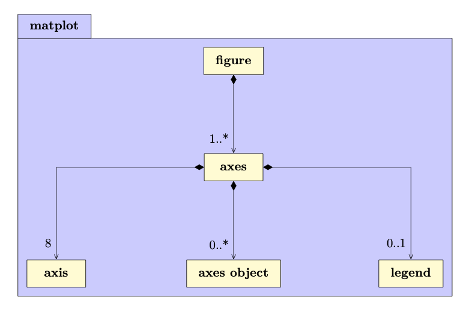

The `figure` object is the object the ultimately connects to a backend. This might be a backend to render interactive plots or to export graphics to a file. A `figure` object might have multiple plots represented by `axes` objects. Each `axes` object has eight `axis` objects. For inexperienced users, the most critical of these `axis` objects are the ones for the coordinates $x$, $y$, and $z$. We discuss these objects in more detail in Section [Figures and Axes](#figures-and-axes).

An `axes object` is an abstract class that can hold a collection of primitives representing plots. These are the objects that ultimately embody the plot categories. We list these categories in Section [Plot Categories](#plot-categories). Lastly, a `legend` object is responsible for storing a list of labels we can associate to each `axes object`, and the appearance of the box where we present these labels.

For convenience, the library interface has a syntax similar to Matplotlib and Matlab. This is helpful to accommodate users transitioning from these environments. Like Matplotlib, we support two coding styles, based on object-oriented programming and free-standing functions. We address these coding styles in Section [Coding Styles](#ccoding-styles). Our interface also employs templates to enable the functions to operate on a range of data types and data structures. We further use method chaining to allow for a more compact syntax.

In Section [Examples](#examples) we examine the interface, provide some more high-level usage examples, illustrate the data formats for images, enumerate some limitations of our current implementation, and contrast our library with similar solutions. We supply numerous emblematic samples for all plot categories in this paper. Besides these instances, the library repository further includes a gallery with hundreds of examples that cover all plot categories and subcategories.

# Figures and Axes


The central object in **Matplot++** is a `figure`, which describes a window or image on which we can plot one or more `axes` objects. The following Figure depict these main classes in more detail.
 
 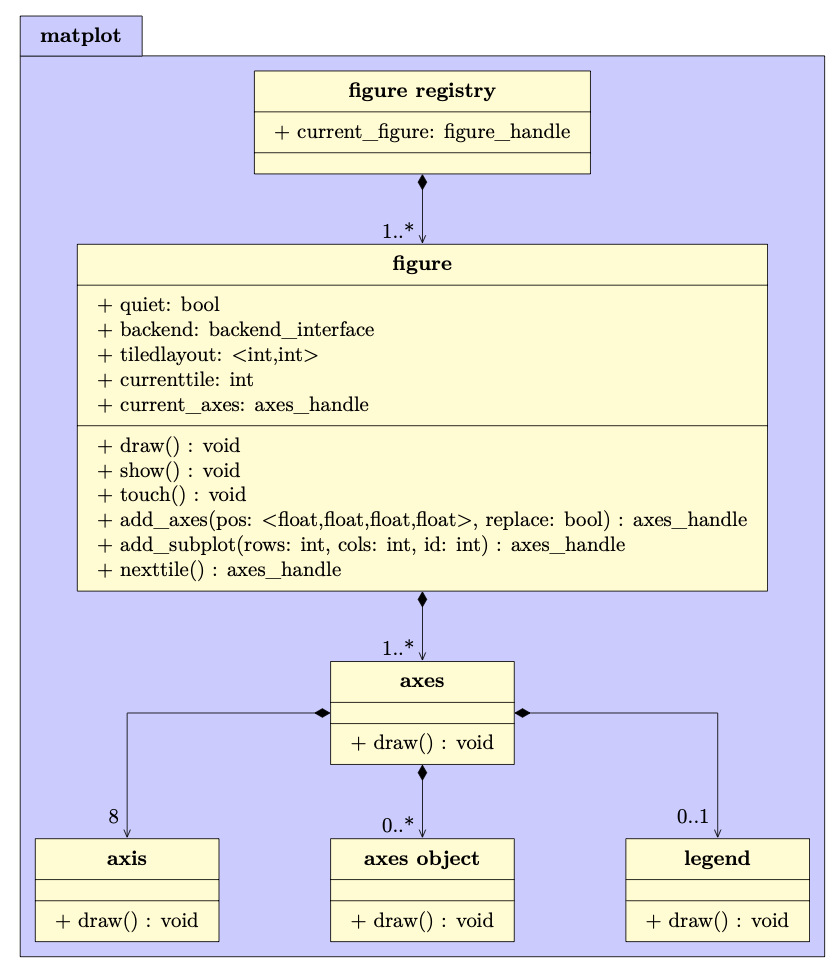
 
 Note that, unless the user needs to control these objects directly, this entire procedure of generating and maintaining the relevant `figure` for a plot is transparent to the user. The data scientist running a short experiment would probably just call a single command to stream their data to whatever plot category seems more suitable to visualize the data.

A simple `figure` will usually have one `axes` object that stores the plots. A figure in quiet mode (non-reactive mode), will only be updated when the user calls the `draw` function, which recursively calls the `draw` function on all its child objects. This is the function we call to send the appropriate commands or vertices to the backend. If a figure is not in quiet mode, updating a property in any child object will automatically call the `draw` function. By default, figures are not in quiet mode.

The `show` function is a variant of `draw` that blocks the execution until the user closes the figure or interacts with the console. This is useful to ensure one can visualize the results before the execution terminates. While this function is helpful for experiments, it should not be employed inside a library that will be used non-interactively. The `touch` function is intended to be used internally by child objects. The function calls `draw` only if the figure is in reactive mode.

The commands `add_axes`, `add_subplot`, and `nexttile` create and properly position new axes in the figure. `add_axes` adds a new `axes` object in any absolute position on the figure, and we can choose to replace an existent `axes` object if it overlaps with the new axes. `add_subplot` will construct a new `axes` object in a position consistent with a layout of `rows` rows and `cols` columns. `nexttile` adds a subplot coherent with the rows, columns, and id defined by `tiledlayout` and `currenttile`.

All these functions return an `axes_handle` object, which is a shared pointer to an `axes` object. The user can use this handle to update axes properties. When the last shared pointer to an `axes` objects ceases to exist, the `axes` object is deallocated from memory. The figure also holds a handle `current_axes`, which points to the last axes we added to the figure unless the user modifies it.

The user can create multiple figures in the same process. If they are all interactive figures, this will open multiple windows in the same process. All new figures go to a global figure registry of figure handles. If the user calls a plotting command, it will use the current figure in the registry. The free-standing function `gcf()` returns a handle to the current figure in the registry. If there is no figure in the registry, `gcf()` adds a new figure to the registry and returns its handle. Because free-standing functions to create plots rely on `gcf()`, if there is no current figure in the registry, the registry creates a new figure for any initial plot the command. This allows users to use the library as a resource to stream their data transparently.

The `axes` object is the object responsible for maintaining the plots. The following Figure presents more details.
 
 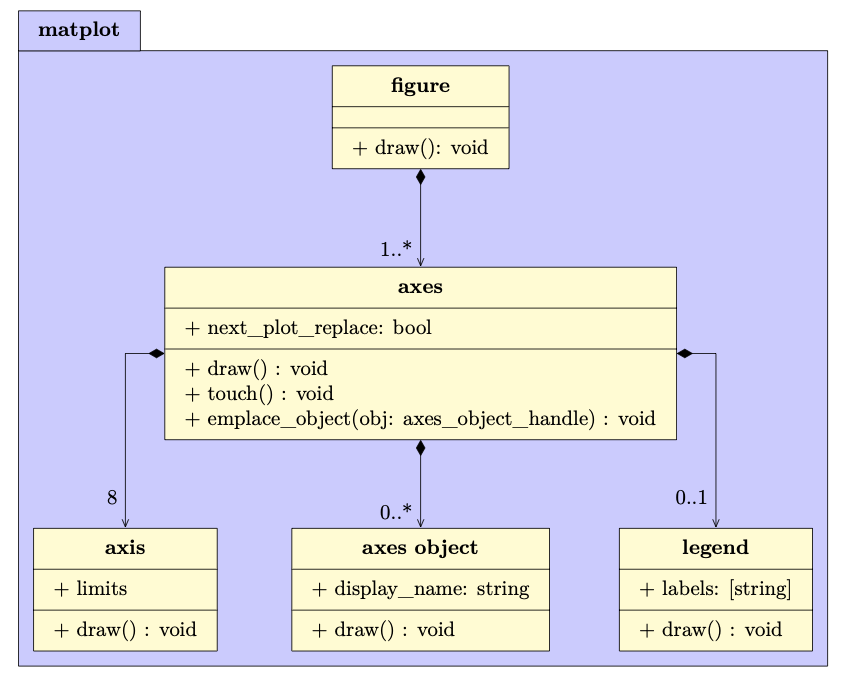
  
 A new `axes` object will have no child objects and no legend. It has only its original collection of `axis` objects with default attributes for each coordinate. If we draw this new `axes` object, we get a figure like:
  
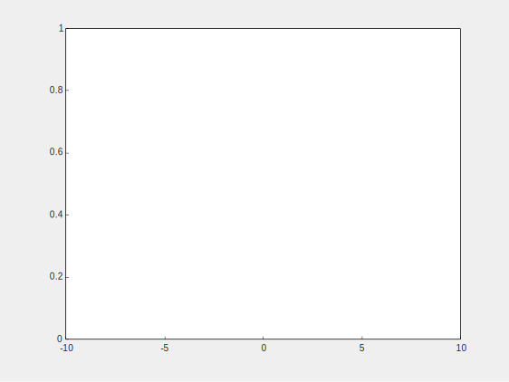
  
  In this Section, we export the figures with a gray background to help the reader differentiate the figure and axes objects. Analogous to `gcf()`, the method `gca()` returns a handle to the current axes in the current figure. If there is no current `axes` object in the figure, `gca()` will create a new `axes`.

The method `emplace_object` pushes a new `axes object` to the `axes`. However, this method is not expected to be used directly. A variety of auxiliary methods create the appropriate `axes object` for a given plot category and make necessary calls to `emplace_object`. For instance,

```cpp
vector<int> y = {2, 4, 7, 7, 6, 3, 9, 7, 3, 5};
plot(y);
```

is internally equivalent to

```cpp
vector<int> y = {2, 4, 7, 7, 6, 3, 9, 7, 3, 5};
line_handle l = make_shared<class line>(gca(), y);
gca()->emplace_object(l);
```

Both would generate this line plot:
 
 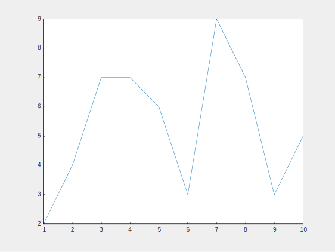

For convenience, we assume throughout this paper we are operating in the `matplot` and `std` namespaces. This practice, nevertheless, is probably not recommendable in large projects and surely not advisable in header files.

Besides the functions presented in last diagram, the `axes` object has dozens of methods to control its appearance. The methods can determine the `axes` location, camera positioning (for 3D plots), shortcuts to define the appearance of `axis` objects, its title, font properties, colors, grids behind the data, and boxes around the axes. These methods are described in detail in the documentation. There are also dozens of shortcuts to construct and emplace objects representing diverse plot categories. We discuss these categories in Section [Plot Categories](#plot-categories).

The `axis` objects depict a specific coordinate. The $x$ and $y$ coordinates are used in two-dimensional plots. Two-dimensional plots can also use the extra coordinates $x_2$ and $y_2$. The $x$, $y$, $z$ coordinates are used in three-dimensional plots. The $r$ and $t$ coordinates are used in polar plots. Finally, the $cb$ coordinate is used to determine the range of colorbars. Colorbars are useful to provide a third dimension to two-dimensional plots. For instance, we can use the $y_2$ axis by

```cpp
vector<int> y1 = {1,10,7,6,7,7,4,6,1,6};
vector<int> y2 = {7,2,9,1,9,7,2,1,10,5};
plot(y1);
hold(on);
plot(y2)->use_y2(true);
```

The `hold` function determines the `next_plot_replace` property of the current `axes`. This property decides whether the next object we emplace in the axes should replace the current objects. The `hold` function expects a `bool` as a parameter. As a convenience for users transitioning from Matlab, we use `constexpr` to define `on` and `off` as aliases for `true` and `false`. As an extra convenience, note how we call `use_y2` through method chaining, which can directly alter properties on the handle. The following Figure shows the resulting plot.

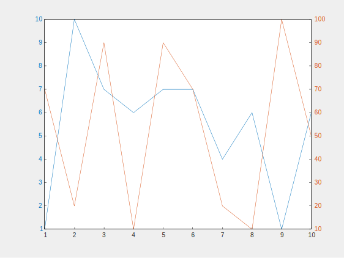

Lastly, if the `axes` object has a `legend` object, it will store labels for the data in the axes and manage the presentation of the box with these labels. The `legend` function can be used to create such an object in the current axes. The function returns a `legend_handle` we can use to set its appearance. The axes objects can get their labels from the `legend` object or their `display_name`. For instance, given a set of line plots, we can combine both strategies by

```cpp
vector<line_handle> ls = plot(random_lines);
legend("Line 1", "Line 2");
ls[2]->display_name("Line 3");
```

This would create the plot presented in the following Figure:
 
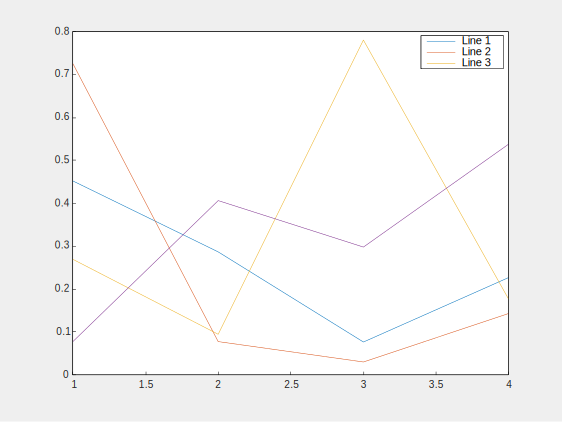
 
In this example, the plot receives four lines as input and returns a list of line handles. We use `legend` function to attribute a label to the first two line handles that have no display name. The third line has its label directly defined with `display_name`. The fourth line has no legend.

# Plot Categories

An `axes` object can hold plots in many categories. An `axes object` is an abstract class that represents what should be drawn in the axes. The following Figure  shows the objects that inherit from `axes objects`.

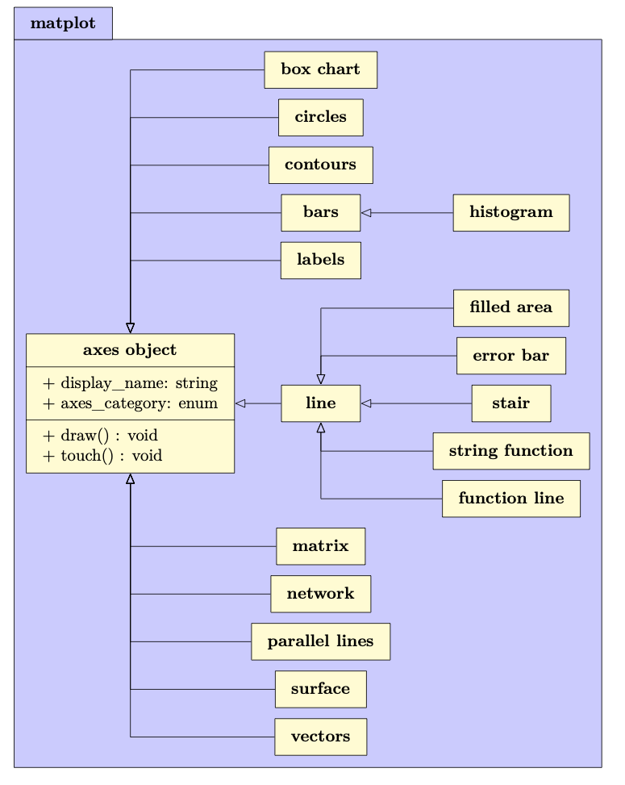

These objects represent primitives that can compose a plot. A plot category might depend on more than one `axes object`. For instance, contour lines might depend on `contours` and `labels`. The same `axes object` can also serve a number of plot categories. For instance, a `matrix` can represent heatmaps and images. By composing `axes objects`, the library offers functions to create plots in the following main categories:

* Line Plots (Section [Line Plots](#line-plots))
* Data Distribution (Section [Data Distribution](#data-distribution))
* Discrete Data (Section [Discrete Data](#discrete-data))
* Geography (Section [Geography](#geography))
* Polar Plots (Section [Polar Plots](#polar-plots))
* Contour Plots (Section [Contour Plots](#contour-plots))
* Vector Fields (Section [Vector Fields](#vector-fields))
* Surfaces (Section [Surfaces](#surfaces))
* Graphs (Section [Graphs](#graphs))
* Images (Section [Images](#images))
* Annotations (Section [Annotations](#annotations))

In the following subsections, we discuss some important details of the algorithms in each of these categories.

## Line Plots

The Line Plots cover the following subcategories: Line Plot; Line Plot 3D; Stairs; Error Bars; Area; Loglog Plot; Semilogx Plot; Semilogy Plot; Function Plot; Function Plot 3D; and Implicit function. Plots in this category depend on the `line` object. This object stores data for two or three-dimensional lines.

The `error bar` object includes extra lines to represent error around data points. Log plots are utility functions that adjust the $x$ or $y$ axes to a logarithmic scale. The `stair` object renders the line with stairs between data points to denote discrete data. Instead of storing data points, the objects `function line` and `string function` store a function as a lambda function or as a string with an expression. These objects use lazy evaluation to generate absolute data points. The data is generated only when the `draw` function is called.

The `filled area` object creates a polygon filling the area between the $x$ axis and each line. Each of these plots can be created by

```cpp
vector<vector<int>> Y = {{1, 3, 4, 0}, {2, 5, 4, 7}, {6, 4, 5, 3}};
area(Y, -4, stacked);
```

where `stacked` is a boolean that tells whether the lines in `Y` should be stacked.

## Data Distribution

The Data Distribution category includes the following subcategories: Histogram; Boxplot; Scatter Plot; Scatter Plot 3D; Binned Scatter Plots; Plot Matrix; Parallel Coordinates; Pie Chart; Heatmap; and Word Cloud. These plot subcategories depend on the `axes object` types `histogram`, `box chart`, `line`, `matrix`, `parallel lines`, `circles`, `labels`.

The `histogram` object creates the histogram edges and bins when the `draw` function is called for the first time with lazy evaluation. Lazy evaluation avoids calculating edges unnecessarily in case the user changes the object parameters before calling `draw`. This object includes several algorithms for automatically delimiting the edges and bins for the histograms. This Figure exemplifies some of these algorithms.

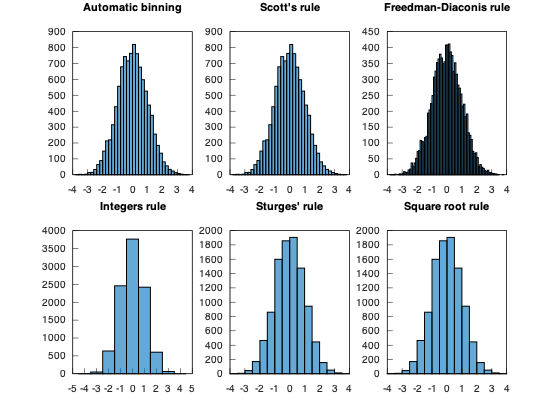

Like the Line Plot subcategories, Scatter plots also depend on the `line` object. As the line object can represent lines with markers, the `scatter` function simply creates markers without the lines. Binned scatter plots use variations of the histogram algorithms of the previous Figure as an extra step to place all the data into two-dimensional bins that can be represented with varying colors or sizes. This is useful when there are so many data points that a scatter plot would be impractical for visualizing the data. The Plot Matrix subcategory is a combination of histograms and scatter plots. It creates a matrix of `axes` objects on the `figure` and creates a scatter plot for each pair of data sets.

The function `parallelplot` creates a plot with Parallel Coordinates. In this type of plot, a `parallel lines` object stores an arbitrary set of `axis` objects to represent multi-dimensional data. This Figure exemplifies the parallel coordinates we can generate by

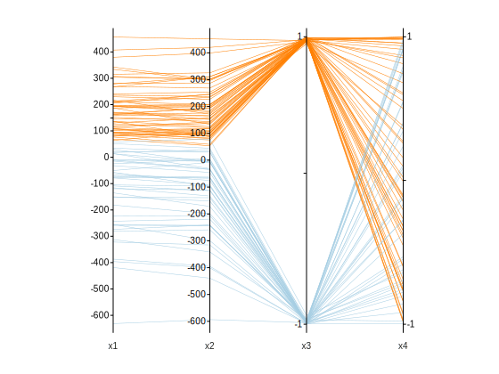

```cpp
vector<vector<double>> X(4);
X[0] = randn(100,50,200);
X[1] = transform(X[0], [](double x){ return x + rand(-30, +30);});
X[2] = transform(X[0], [](double x){ return x > 50 ? +1. : -1.;});
X[3] = transform(X[0], [](double x){ return cos(rand(-30, +30));});
parallelplot(X,X[2]);
```

where `randn` and `transform` are shortcuts to generate random numbers with a normal distribution and to transform data. The second parameter of `parallelplot` determines the color of each data point, for which we use `X[2]`. Those axes are generated on top of a two-dimensional `axes` object.

Word clouds are generated from text or pairs of words and their frequency. After attributing a size proportional to each word frequency, the algorithm to position the labels iterates words from the largest to the smallest. For each word, it spins the word in polar coordinates converted to Cartesian coordinates until it does not overlap with any other word. This Figure exemplifies a word cloud we can generate by


```cpp
wordcloud(tokens, count);
```

By default, the colors and the sizes depend on the word frequencies. We can customize the colors by passing a third parameter to the `wordcloud` function.

## Discrete Data

The Discrete Data category includes the following subcategories: Bar Plot; Pareto Chart; Stem Plot; and Stem Plot 3D. These subcategories depend on the `axes object` types `bars` and `line`. Bar Plots depend on the `bars` object. Pareto Charts emplace a combination of `bars` and `line`. Stem plots rely on the `line` object.

Pareto Charts are a type of chart that uses both $y$ axes. The $y_1$ axis is used to represent bars with the data values in descending order. The $y_2$ axis is used to represent the cumulative distribution function of the data in the $y_1$ axis. This next Figure exemplifies a Pareto chart generated by

```cpp
vector<double> y = randn(20,500,1000);
pareto(y);
```


By default, a Pareto Chart includes up to 10 items or as many items as needed to represent 95\% of the cumulative distribution.

If the reader needs Pareto *fronts* rather than Pareto *charts*, we refer to Scatter Plots for two-dimensional fronts, Plot matrices for three-dimensional fronts, or Parallel Coordinates for many-objective fronts. These plot subcategories are described in Section [Data Distribution](#ddata-distribution). If the user also needs a tool to calculate these fronts efficiently, we refer to the [Pareto Front Library](https://github.com/alandefreitas/pareto-front).

## Geography

The Geography category includes the following subcategories: Geoplot, Geoscatter, Geobubble, and Geodensity. All these subcategories depend on the `line` object to plot maps and data over these maps. For the first geography plot, we call `geoplot()`, which creates a filled polygon with the world map. This first plot receives the tag `"map"` so that subsequent geography plots recognize there is no need to recreate this world map.

The data for the world map comes from Natural Earth. They provide data at 1:10m, 1:50m, and 1:110m scales. The `geoplot` function will initially use the data at the 1:110m scales. The `geolimits` function can be used to update the axis limits for geography plots. The difference between the usual functions for adjusting axis limits (`xlim` and `ylim`) and `geolimits` is that the latter will also update the map resolution according to the new limits for the $x$ and $y$ axis.

The `geolimits` function will query the `figure` size and, depending on the new limits for the axes, update the map to the 1:10m, or 1:50m scales if needed. Because it would be very inefficient to render the whole world map at a 1:10m or 1:50m scale only to display a region of this map, the `geolimits` function also crops the data pertinent to the new region being displayed.

Note that this does not only involve removing data points outside the new limits but it also needs to create new data points on the correct borders to create new polygons coherent with the map entry points in the region. For this reason, the algorithm needs to track all submaps represented as closed polygons in the original world map. If submaps are completely inside or outside the new ranges, we can respectively include or dismiss the data points. However, if the submap is only partially inside the new limits, to generate the correct borders for the polygons, we need to track all points outside the limits to classify the directions of these points outside the limits. We do that by only including points that change quadrants around the new limits so that the map entry points create polygons that look like they would if the complete world map were still being rendered outside these new limits.

If the library user is not interested in geographic plots, the build script includes an option to remove the high-resolution maps at 1:10m and 1:50m scales from the library. In this case, the library will always use the map at a 1:110m scale no matter the axis limits. Figure exemplifies the map generated by

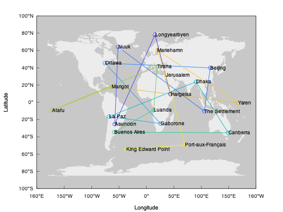

```cpp
auto [lon,lat,names] = world_cities(6,8);
auto [lon2, lat2] = greedy_tsp(lon,lat);
geoplot(lat2,lon2)->marker("o").marker_colors(iota(1,names.size()));
text(lon,lat,names);
```

The function `world_cities` returns a list of major world cities. Its parameters define the minimum distances between cities in the $x$ and $y$ axes. The `greedy_tsp` function is a naive greedy algorithm to find a route between these cities as a Traveling Salesman Problem (TSP). We use the `geoplot` function to draw this route. Note that we use method chaining to define some further plot properties. Finally, the `text` function includes the city names in the map.

## Polar Plots


The Polar Plots category includes the following subcategories: Polar Line Plot, Polar Scatter Plot, Polar Histogram, Compass, and Polar Function. These subcategories depend on the `axes object` types `line`, `histogram`, `vectors`, `string function`, and `function line`. By emplacing a polar plot in the `axes`, the `axes` move to a polar mode, where we use the $r$ and $t$ axis instead of the $x$ and $y$ axis.

From the backend point of view, these axes are an abstraction to the user. The data points in the $r$ and $t$ axis are drawn by converting the positions from the polar coordinates $r$ and $t$ to the Cartesian coordinates $x$ and $y$ with the relationships $x=r \cos{t}$ and $y=r \sin{t}$.

Aside from this conversion, these plot subcategories are analogous to line plots, scatter plots, histograms, quiver plots, and line functions. The next Figure exemplifies the polar histogram generated by

```cpp
vector<double> y = randp(100,1.0,0.5);
polarhistogram(y, 25);
```


The function `polarhistogram` distributes the data into the number of bins provided as its second parameter.

## Contour Plots

The Contour Plots category includes the following subcategories: Contour Plots, Filled Contours, and Function Contour. All these subcategories depend on the `contours` type. They also depend on lazy evaluation for generating the contour lines. When the function `draw` is called in the `contours` class, it preprocesses all contour lines for a three-dimensional function.

Although it is relatively simple to show a heatmap with the values for the $z$-axis, calculating contour lines relative to the $z$-axis is more complex than it might seem at first. We provide the function `contourc` for calculating contour lines. This function uses an adaptation of the algorithm adopted by Matplotlib.

The algorithm creates a quad grid defined by the $x$ and $y$ values. It uses this grid to infer a contour line passing through positions with the same $z$ value. The algorithm sweeps through the grid twice to generate these lines. The first sweep looks for lines that start on the boundaries. The second sweep looks for interior closed loops.

Filled contours are closed polygons for pairs of contour levels. Some polygons for filled contours might be holes inside other polygons. The algorithm needs to keep track of these relationships so that we can render the polygons in their accurate order. To avoid an extra step that identifies this relationship between the polygons, the sweeping algorithm already identifies which polygons are holes for each level.

Once we find the quads with the contour line, the line is generated by interpolating the $z$ values around that quad. For instance, consider the Rastrigin function:

```cpp
auto rastrigin = [](double x, double y) {
    return 10 * 2 + pow(x,2) - 10 * cos(2*pi*x) + pow(y,2) - 10 * cos(2*pi*y);
};
```

The next Figure exemplifies the filled contour lines generated for this function by

```cpp
fcontour(rastrigin)->filled(true);
```


By default, the function `fcontour` will generate 9 contour lines from a lambda function. The functions `contour` and `contourf`, on the other hand, plot contour lines and filled contour lines from a grid of data points for $x$, $y$, and $z$.

## Vector Fields

The Vector Fields category includes the following subcategories: Feather, Quiver, and Quiver 3D. All these subcategories depend on the `vectors` object type. In a two-dimensional plot, for each value of $x$ and $y$ with the position of a vector, it also requires the value of $u$ and $v$ indicating its direction and magnitude. In a three-dimensional plot, the direction and magnitude are defined by $u$, $v$, and $w$.

A quiver plot (or velocity plot) shows a grid of vectors whose direction and magnitude are scaled to prevent the overlap between vectors in subsequent quads. Still considering the Rastrigin function, we can generate a grid with its data values and its gradient by

```cpp
auto [x,y] = meshgrid(iota(-5,.2,5));
auto z = transform(x,y,rastrigin);
auto [dx,dy] = gradient(z,.2,.2);
```

where `meshgrid`, `transform`, and `gradient` are simple convenience functions. We can then present the contours lines and the gradient directions by

```cpp
contour(x,y,z);
hold(on);
quiver(x,y,dx,dy);
```

The following Figure [quiver](#quiver) presents the results, where the quiver vectors help us identify the directions in which the function is decreasing in the contour plot.


## Surfaces

The Surfaces category includes the following subcategories: Surface; Surface with Contour; Mesh; Mesh with Contour; Mesh with Curtain; Function Surface; Function Mesh; Waterfall; Fence; and Ribbon. All these subcategories depend on the `surface` class.

The Waterfall, and Fence subcategories create surface slices for each value of $y$. The Ribbon subcategory creates surface slices for each value of $x$. Still considering the Rastrigin function, the next Figure exemplifies the Ribbon plot generated by

```cpp
auto [X,Y] = meshgrid(iota(-5,1,5),iota(-5,.1,5));
auto Z = transform(X,Y,rastrigin);
ribbon(X,Y,Z)->face_alpha(0.8);
```

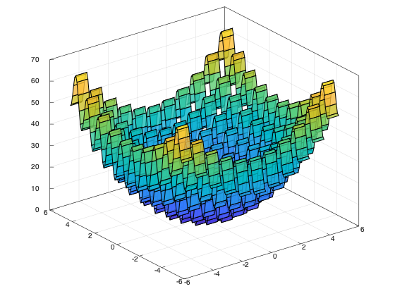

To make the visualization more comfortable, we define a larger step size on the $x$ axis.

## Graphs

The Graphs category includes the following subcategories: Undirected Graphs; and Directed Graphs. All these subcategories depend on the `network` class. Graphs are abstract structures that represent objects and relationships between these objects. The objects are represented as vertices and the relationships are depicted as edges.

In an abstract graph, the vertices have no specific position in space. Mathematically, a graph does not depend on its layout. However, the graph layout has a large impact on its understandability. The `network` class can calculate appropriate positions for graph vertices with several algorithms: Kamada Kawai algorithm, Fruchterman-Reingold algorithm, circle layout, random layout, and automatic layout.

The implementation of the Kamada Kawai and Fruchterman-Reingold algorithms depend on the NodeSoup library. The next Figure exemplifies the Undirected Graph generated by

```cpp
vector<pair<size_t, size_t>> edges = {{0, 1},
                                      {0, 2},
                                      {1, 2},
                                      {1, 4},
                                      {2, 3},
                                      {3, 5},
                                      {4, 5},
                                      {4, 6},
                                      {6, 8},
                                      {8, 9},
                                      {7, 9},
                                      {8, 7},
                                      {9, 10}};
vector<double> weights = {4,4,2,1,1,4,2,1,3,3,2,4,1};
graph(edges)->edge_labels(weights);
```

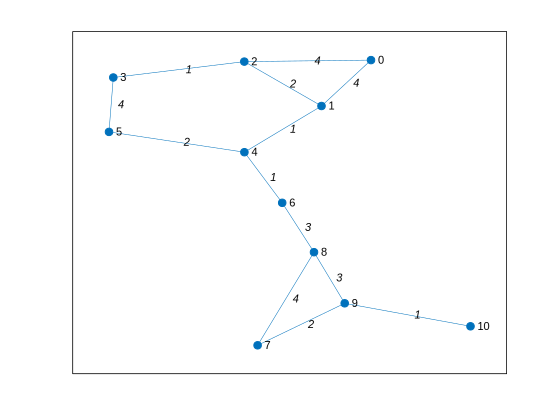

The automatic layout uses the Kamada Kawai algorithm for small graphs and the Fruchterman-Reingold algorithm for larger graphs.

## Images

The Images category includes the following subcategories: Image Show; Image Matrix; and Scaled Image. These subcategories depend on the `matrix` class. The `matrix` class can have up to four matrices. If it has only one matrix, it is represented with a colormap. If it has three matrices, they represent the red, green, and blue channels. If it has four matrices, the fourth matrix represents an alpha channel to control the transparency of each pixel.

We use the CImg library to load and save images. CImg can handle many common image formats as long as it has access to the appropriate libraries. The **Matplot++** build script will look at compile-time for the following optional libraries: JPEG, TIFF, ZLIB, PNG, LAPACK, BLAS, OpenCV, X11, fftw3, OpenEXR, and Magick++. The build script will attempt to link all libraries from this list to **Matplot++**.

**Matplot++** includes a few convenience functions to manipulate matrices with images: `imread`, `rgb2gray`, `gray2rgb`, `imresize`, and `imwrite`. All these functions work with lists of matrices. The next Figure exemplifies the image generated by

```cpp
auto image = imread("lena_gray.tiff");
imshow(image[0]);
colormap(palette::default_map());
```

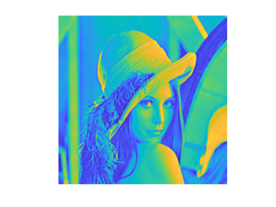

Because `image` is a list of matrices, `image[0]` is a matrix with the gray channel. If we used `imread` to load a colored image, `image[0]` would represent the red channel. Because the matrix has only one channel, it uses the default colormap. By default, the `imshow` function sets the grayscale colormap as the axes colormap. We use the `colormap` function to change it to the default colormap and generate a colored image.

## Annotations

The Annotations category includes the following subcategories: Text; Text with Arrow; Rectangle; Filled Polygon; Ellipse; Textbox; Arrow; and Line. These subcategories depend on the `axes object` types `labels`, `line`, and `vectors`. The annotations category is meant to create individual objects on the plot rather than representations of data sets.

An important difference between the annotations category and other categories is that, by default, the annotations do not replace the plot that already exists in the `axes` object, even if the user does not call the `hold` function. The next Figure exemplifies a number of annotations generated by

```cpp
vector<double> x = {0,8,8,0};
vector<double> y = {0,0,4,4};
polygon(x, y, "g");
rectangle(0,0,2,4,0)->fill(true).color("red");
rectangle(3,0,2,4,1)->fill(true).color("magenta");
rectangle(6,0,2,4,0.5)->fill(true).color("yellow");
text(2,2,"Curvature 0")->alignment(labels::alignment::right);
text(4,2,"Curvature 1")->alignment(labels::alignment::center);
text(6,2,"Curvature 0.5")->alignment(labels::alignment::left);
arrow(4,2.2,3,3);
textarrow(6,1,8,0,"Last corner");
```


The rectangle object can have a border curvature from $0$ to $1$. We can also annotate with text, arrows, polygons, and lines.

## Appearance

All objects have numerous methods to control their appearance. This control is fundamental for high-quality publication images. As a convenience, the `colors.h` header contains many functions to generate colors from strings and vice-versa. It also contains dozens of functions to generate colormaps.

The `axes` object has functions to control the labels for each axis, the subplot title, and the legends for child objects. Each `axis` object has functions to control its limits, manually adjust the axis ticks, define labels for manual ticks, and label formats for automatic ticks.

There are various functions that allow and facilitate multiplots in a figure. The `hold` and `use_y2` functions allow multiple plots on the same `axes` object. The `subplot` and `nexttile` functions allow a layout with many `axes` objects on the same `figure`. Another option is to create extra `figure` objects, which would open more plot windows.

The colormaps can be used with two-dimensional plots to represent an extra dimension.  Finally, the `view` and `lightning` functions can be used in three-dimensional plots to change the camera position and light intensity. The next Figure exemplifies two camera and lighting configurations for the Ackley function. The example is generated by

```cpp
auto ackley = [](double x, double y) {
    return -20 * exp(-0.2 * sqrt(0.5 * (pow(x,2)+pow(y,2))))
           - exp(0.5 * (cos(2*pi*x) + cos(2*pi*y))) + exp(1) + 20;
};

subplot(1,2,0);
fsurf(ackley)->lighting(true).primary(0.7).specular(0.9);

subplot(1,2,1);
fsurf(ackley);
rotate(20,30);
```


# Coding Styles

## Member vs. Free-standing Functions

Like in Matplotlib, we support two coding styles: Free-standing functions and an Object-oriented interface. With free-standing functions, we call functions to create plots on the current axes. The global current `axes` object is the current `axes` object in the current figure in the global figure registry (Section [Figures and Axes](#figures-and-axes)). For instance, one can use `plot(y);` to create a line plot on the current axes (or create a new `axes` object if needed). Also, one can use `plot(ax,y);` to create a line plot on the `axes` object `ax`. This is less verbose for small projects and quick tests. The library looks for existing axes to create the plot.

In the object-oriented interface, we explicitly create figures and call methods on them. For instance, one can use `ax->plot(y);` to plot on the `axes` object `ax`. We can create the same line plot on the current axes by `auto ax = gca(); ax->plot(y);`. This is less verbose and provides better control in large projects where we need to pass these objects around. The user manages axes handles containing plots.

Assuming the user is explicitly managing the axes to create plots in another function, a more complete example of these styles could be

```cpp
// Free-standing functions
auto ax = gca();
plot(ax, x, y)->color("red").line_width(2);
my_function(ax);
```

and

```cpp
// Object-oriented interface
auto ax = gca();
ax->plot(x, y)->color("red").line_width(2);
my_function(ax);
```

Both examples would generate the same plot. All free-standing functions are templated functions that use meta-programming to call the main function on the current `axes` object. If the first parameter is not an `axes_handle`, it will get an `axes_handle` from the figure registry with `gca` (Section [Figures and Axes](#figures-and-axes)) and forward all parameters to the function in this `axes` object. If the first parameter is an `axes_handle`, the template function will forward all parameters, but the first one, to this `axes` object. This use of templates for the free-standing functions keeps both coding styles maintainable by the developers.

Note that, because the example needs the `axes` object for the function `my_function`, we also need to get a reference to the `axes` object with the free-standing functions. In that case, the free-standing functions are not less verbose than the object-oriented interface.

To adhere to free-standing functions, we could create two versions of `my_function`: one that receives an `axes_handle`, and a second version that would get an `axes_handle` from the figure registry and call the first version. If `my_function` is going to be exposed to other users as a library, this could be a convenience to these users. However, notice that this is only moving the verbosity from the main function to `my_function`. In fact, this is how the free-standing functions in **Matplot++** work.

## Reactive figures

There are also two modes for figures: reactive (or interactive) mode and quiet mode. Figures in reactive mode are updated whenever any of their child objects change. This happens through the `touch` function, that gets called on any child object when it changes its appearance. This creates an interactive mode in which figures are updated as soon as we adjust their properties. If we combine interactive figures with free-standing functions, we have a "Matlab-like style" for plots. This is a coding pattern where the figure registry works as a stream for plots.
The problem with this coding style is that the user might unnecessarily create useless intermediary plots.

Figures in quiet mode are updated by calling the functions `draw()` or `show()` (Section [Figures and Axes](#figures-and-axes)). Unless these functions are called, nothing changes in the figure. The combination of the object-oriented coding style and quiet mode is the "OO-Matplotlib-like style" for plots. This is a coding style in which the user explicitly decides when the plot is shown or updated. This is beneficial to applications that cannot waste computational resources on intermediary figures that might not be valuable to the application.

We generally use free-standing functions with reactive mode and the object-oriented interface with quiet mode. By default, new figures are in reactive mode, unless it is using an non-interactive backend. One can turn this reactive mode on and off with:


* `ion()` or `ioff()` free-standing functions
* `reactive(bool)` or `quiet(bool)` function on the `figure` object
* `figure(true)` or `figure(false)` when explicitly creating a new figure

A more complete example of the reactive mode would be:

```cpp
// Reactive mode
auto f = gcf(false);
auto ax = f->gca();
auto p = ax->plot(ax, x, y);   // draws once
p->color("red").line_width(2); // draws twice more
wait();                        // pause console
```

For convenience, the examples in Section [Plot Categories](#plot-categories) use the reactive mode. The `wait` function pauses the console until the user interacts with the plot window. If the backend is based on process pipes, because these are unidirectional, closing the window is not enough to resume. The user needs to use the console to unblock execution. A similar example is quiet mode would be

```cpp
// Quiet mode
auto f = gcf(true);
auto ax = f->gca();
auto p = ax->plot(x,y);        // does not draw
p->color("red").line_width(2); // does not draw
f->show();                     // draw only once and pause console
```

In this example, the figure is only updated once. The user could replace the `show` function with the `draw` function, but the window would close as soon as execution completes. It is important to use `wait()` and `show()` with caution. These functions are meant for some particular executables so that an interactive plot does not close before the user can see it. It is probably unreasonable to call these functions inside a library because the user would have to manually interfere with the execution to continue.

## Method Chaining

To support a more compact syntax, the library allows method chaining on plot objects. For instance, we can create a simple line plot and modify its appearance by

```cpp
// Using the line handle
auto p = plot(x,y,"--gs");
p->line_width(2);
p->marker_size(10);
p->marker_color("b");
p->marker_face_color({.5,.5,.5});
```

or

```cpp
// Method chaining
plot(x,y,"--gs")->line_width(2).marker_size(10).marker_color("b").marker_face_color({.5,.5,.5});
```

The first code snippet works because `plot` returns a `line_handle` to the object in the `axes`. We can use this line handle to modify the line plot. Whenever we modify a property, the setter function calls `touch`, which will `draw` the figure again if it is in reactive mode. The second option works because setters return a reference to `*this` rather than void. 

## Ranges


The plotting functions work on any range of elements convertible to `double`. For instance, we can create a line plot from a set of elements by

```cpp
set<int> y = {6,3,8,2,5};
plot(y);
```

Any object that has the functions `begin` and `end` are considered iterable ranges. Most `axes object` subclasses use `vector<double>` or `vector<vector<double>>` to store their data. For convenience, the `common.h` header file includes the aliases `vector_1d` and `vector_2d` to these data types.

These conversions also work on ranges of ranges:

```cpp
vector<set<int>> Y = {{6,3,8,2,5},{6,3,5,8,2}};
plot(Y);
```

Unfortunately, because of how templated functions work, one exception is initializer lists. Initializer lists only work for functions that are explicitly defined for them.

## Utilities

The headers `common.h` and `colors.h` include a number of utilities we use in our examples. These include naive functions to generate and manipulate vectors and strings; handle RGBA color arrays; convert points to and from polar coordinates; read files to strings; write strings to files; calculate gradients; read, write, and manipulate images; and generate vectors with random numbers. Although some of these functions might be helpful, most functions only operate on `vector<double>` and they are not intended to be a library of utilities. The sole purpose of these algorithms is to simplify the examples.

# Backend Interface

While **Matplot++** provides a shared representation for plots, there are innumerable technologies through which these objects can become interactive or non-interactive images. Users might want to export images, monitor metrics in real-time, or generate images for GUIs that might involve several libraries. It is unrealistic to anticipate the technologies involved in all applications that might benefit from **Matplot++**. 

The only way to open these possibilities to users is by separating the implementation layers managing objects from the layers that generate the images for a given application. This enables users to reuse the **Matplot+**+ data structures in any application. For this reason, the `figure` object stores a shared pointer to a `backend_interface` that is responsible for ultimately drawing the plots.

Libraries, such as Matplotlib, and languages with plotting capabilities, like Octave, usually have many backends for drawing objects, depending on the operating system and user demands. For interactive plots, these usually involve backends that are specific to the operating system.

The `backend_interface` has many virtual functions that can be overridden to create new backends for these plots. The first set of functions in this interface are designed to identify the operation mode of a backend. The function `is_interactive` returns whether a backend is in interactive mode. Note that a backend can operate on both modes, depending on its parameters. For instance, a Gnuplot backend can work in interactive or non-interactive mode, depending on its terminal. Also, an OpenGL backend can work in non-interactive mode, in which case we would export its current pixels to an image file. The function `output` defines the output file name and file format for non-interactive plots.

The next set of functions in the `backend_interface` are related to figure properties. These include functions to set or get the figure properties such as width, height, position, background color. The position is mostly relevant for interactive plots. Note that although we can set the image size through the `figure` object, the width and height properties are ultimately stored in the backend. The reason for this is that, in interactive plots, the user might manually move and resize the window, and the `figure` object has to respond accordingly.

The last set of commands are related to drawing. In that regard, there are two types of backends. Some backends, like a Gnuplot backend, are based on commands and some backends, like an OpenGL backend, are based on vertices. We could try to recreate Gnuplot commands that would emulate a library based on vertices, but such a strategy would be wasteful. It would require the Gnuplot backends to find workarounds to bypass its default axes objects, manually recreate projections, and require the Gnuplot pipe to execute more commands than would be necessary for the plots. 

In that case, our preliminary solution has been to include interfaces for commands and vertices. If a backend is based on commands, functions such as `run_command` should be overridden to consume these commands. If a backend is based on vertices, functions such as `draw_path` and `draw_image` should be overridden to directly draw the specified vertices on the canvas.  Because the library is in an embryonic stage regarding its available backends, the `backend_interface` is open for change as we identify new demands from backend developers. These extensions might involve more complex strategies for unifying the types of backends, internal algorithms for 3D graphical projections, or abstractions to draw different types of objects through the backend.

# Examples

In this Section, we compare our interface with other similar libraries, provide examples integrating the library into some scientific applications, explain how unique plot categories can be defined, and discuss some limitations of the library.

## Interface

Although the internal structure of **Matplot++** is not the same as Matplotlib or the Matlab graphics functions, all interfaces are very similar. The comparable function names are mostly intended as a convenience to the transitioning user who is not concerned about specific internal details of the library.

We cover almost all plot categories that exist in Matplotlib and Matlab. However, it seems like Matplotlib has no special plot category for networks. In Python, this can be solved with NetworkX. It is also important to note that Matlab has innumerable astounding toolboxes for various categories of problems and these toolboxes tend to include graphics for their specific domains. **Matplot++** has neither the intention nor the capacity to compete in that domain.

## A Minimal Application

Section [Plot Categories](#plot-categories) previously included many examples that cover each plot category. The repository contains hundreds of examples that include all subcategories. Thus, it would be redundant to spend this Section with disconnected examples of more plot subcategories. Rather, in this Section we exemplify a use case where the user wants to integrate plots into a minimal application. This provides an opportunity to discuss how one can manage handles and apply the coding styles of Section [Coding Styles](#coding-styles) in an application.

In this example, let us suppose our data scientist is using the Travelling Salesman Problem (TSP) as a model to plan an Eurotrip. We can define the city names and their geographical positions:

```cpp
vector<string> names = {"Tirana", "Andorra la Vella", "Vienna" /*, ...*/};
vector<double> lat = {+41.3317,+42.5075,+48.2092 /*,...*/};
vector<double> lon = {+19.8172,+1.5218,+16.3728 /*,...*/};
```

The complete example, with 44 cities, is available in our repository. Because the `axes` object is going to be managed inside an application, we create a quiet figure and pass its only `axes` object to our object `eurotrip_solver` representing the application by

```cpp
figure_handle f = figure(true);
eurotrip_solver s(lat,lon,names, f->current_axes());
s.run();
```

The `eurotrip_solver` has the following interface:

```cpp
class eurotrip_solver {
public:
    eurotrip_solver(const vector<double>& lat, const vector<double>& lon, const vector<string>& names, axes_handle ax);
    void run(int iterations = 100);

private:
    void setup_starting_point(size_t iteration);
    double tour_distance(const vector<size_t>& tour);
    void iteration();
    static vector<vector<size_t>> get_neighbors(const std::vector<size_t>& tour);
    bool update_if_better(const vector<size_t> &neighbor);
    void draw_if_improvement();
    void draw();

private:
    vector<double> lat_;
    vector<double> lon_;
    vector<string> names_;
    axes_handle ax_;

    // Current tour
    double curr_dist_{0.0};
    vector<size_t> curr_tour_;

    // Best tour
    double min_dist_{0.0};
    vector<size_t> best_tour_;
};
```

A note to programmers not familiar with C++ is that `size_t` is an unsigned integer type commonly used to represent sizes and indexes. The `eurotrip_solver` object includes a reference to an `axes_handle` and `vector`s with information about the cities. This is all the information we need to plot our map. The `run` function will generate a new starting tour `curr_tour_` and run an iteration of the algorithm `iterations` times:

```cpp
void eurotrip_solver::run(int iterations) {
    for (size_t i = 0; i < iterations; ++i) {
        setup_starting_point(i);
        iteration();
    }
    ax_->draw();
    ax_->parent()->save("eurotrip.svg");
}
```

The function `setup_starting_point` creates an initial tour with a greedy algorithm that uses the current iteration as seed for its starting point. This is meant to generate a different starting point for each iteration. The `iteration` function runs a local search algorithm on that starting point. It visits all neighbors of `curr_tour_` and stores any neighbors that happen to be better than `best_tour_`. Whenever we find a better solution, the `iteration` function calls the `draw` function:

```cpp
void eurotrip_solver::iteration() {
    bool improvement = true;
    while (improvement) {
        improvement = false;
        for (const auto& neighbor: get_neighbors(curr_tour_)) {
            improvement = update_if_better(neighbor);
            draw_if_improvement();
            if (improvement) {
                break;
            }
        }
    }
}
```

While calling a `get_neighbors(curr_tour_)` to pre-calculate all neighbors is certainly not an efficient solution, it is an abstraction that serves this example well by abstracting away unnecessary details of the search algorithm. The function `update_if_better` will update `curr_tour_` and `best_tour_` if the `neighbor` solution happens to be better than any of them.

The `draw_if_improvement` function will only call the `draw` if there has been some improvement on the best solution. We also use this opportunity to check the last time we called `draw` and skip the function call if the frame rate happens to be higher than necessary. This is useful in this sort of algorithm to make sure we do not spend more time plotting than searching for solutions.

```cpp
void eurotrip_solver::draw_if_improvement() {
    static auto last_draw = chrono::high_resolution_clock::now()
                                           - chrono::seconds(1);
    static auto min_dist_when_last_draw = min_dist_;
    const auto current_time = chrono::high_resolution_clock::now();
    const bool its_been_a_while = current_time - last_draw > chrono::seconds(1);
    const bool things_are_better = min_dist_ < min_dist_when_last_draw;
    if (its_been_a_while && things_are_better) {
        last_draw = current_time;
        min_dist_when_last_draw = min_dist_;
        draw();
    }
}
```

Finally, the `draw` function uses our `axes_handle` to update the figure whenever we find a better solution:

```cpp
void eurotrip_solver::draw() {
    ax_->clear();
    ax_->geolimits(min(lat_)-5,max(lat_)+5,min(lon_)-2,max(lon_)+10);

    vector<double> sorted_lat;
    vector<double> sorted_lon;
    for (const int &idx : best_tour_) {
        sorted_lat.emplace_back(lat_[idx]);
        sorted_lon.emplace_back(lon_[idx]);
    }
    sorted_lat.emplace_back(lat_[best_tour_[0]]);
    sorted_lon.emplace_back(lon_[best_tour_[0]]);
    ax_->geoplot(sorted_lat, sorted_lon);

    ax_->hold(true);
    ax_->geoscatter(lat_,lon_);

    auto [lon_c,lat_c,names_c] = clear_overlapping_labels(lon_,lat_,names_,1,1);
    ax_->text(lon_c,lat_c,names_c);

    ax_->title("Tour distance " + num2str(min_dist_));

    ax_->draw();
}
```

Because we are moving the handles around, we use the object-oriented coding style. The `geolimits` function will adjust the map limits around Europe. The `draw` function will then create a line going through the cities according to the order indicated by the current best tour. The `geoscatter` function does not need the cities to be in order because it plots no lines. The `text` function creates an annotation on top of the map with the city names. The function `clear_overlapping_labels` is an auxiliary function to remove overlapping labels from the map. The `title` function creates a title with the current distance.

Because the figure is in quiet mode, we need to call the `draw` function. In this case, the quiet mode avoided rendering the figure five times with unnecessary intermediary plots. Besides interactively showing intermediary results during the algorithm execution, the `run` function also saves the figure to a vector graphics, that is appropriate for printing the results at any size. The `save` function will temporarily and transparently change the `figure` backend to a non-interactive backend for Scalable Vector Graphics (SVG) and draw the figure to an output file. The following Figure shows the final image.


## Applications Managing Plot Handles

Notice in the previous example that we only keep a handle for the `axes` object in our application. Every time we call the `draw()` function, we clear the `axes` object and recreate its plots. For instance, this algorithm is recalculating the same `geolimits` every time we update the plot.

In this Section, we examine a more high-level use case where we cache handles to the `axes` object and its plots to update the figure more efficiently. Whenever we find a better solution, we only update the plots instead of recreating them on the `axes` object. To differentiate the example, we consider the Americas for this example

```cpp
vector<string> names = {"Marigot","The Valley","Saint John's"/*,...*/};
vector<double> lat = {18.0731,18.2166,17.1166/*,...*/};
vector<double> lon = {-63.0822,-63.0500,-61.8500/*,...*/};
```

The `americas_trip_solver` now has two extra-members in its interface:

```cpp
class americas_trip_solver {
// ...
private:
    void setup_axes();
// ...
    line_handle lh_;
};
```

The extra handle to the line plot inside the `axes` object allows us to only modify the data in that plot instead of recreating all the plots. The code that was previously in `draw` will now be split between `draw` and `setup_axes`. We plot almost everything in the `setup_axes` function:

```cpp
void americas_trip_solver::setup_axes() {
    ax_->clear();
    ax_->geolimits(min(lat_)-5,max(lat_)+5,min(lon_)-30,max(lon_)+50);
    lh_ = ax_->geoplot(lat_, lon_);
    ax_->hold(true);
    ax_->geoscatter(lat_,lon_);
    auto [lon_c,lat_c,names_c] = clear_overlapping_labels(lon_,lat_,names_,2,2);
    ax_->text(lon_c,lat_c,names_c);
    ax_->draw();
}
```

Notice that we do not need to recreate the map, the scatter points, or the text annotation when drawing the plot. When plotting the route, we keep a handle to the `line` object in `lh_`. This is the only element we need to update when drawing the plot with a new route. Thus, the `draw` function is simplified to

```cpp
void americas_trip_solver::draw() {
    vector<double> sorted_lat;
    vector<double> sorted_lon;
    for (const int &idx : best_tour_) {
        sorted_lat.emplace_back(lat_[idx]);
        sorted_lon.emplace_back(lon_[idx]);
    }
    sorted_lat.emplace_back(lat_[best_tour_[0]]);
    sorted_lon.emplace_back(lon_[best_tour_[0]]);
    lh_->x_data(sorted_lon);
    lh_->y_data(sorted_lat);
    ax_->title("Tour distance " + num2str(min_dist_));
    ax_->draw();
}
```

The function is only responsible for creating a different line with the current route and updating the title. This significantly simplifies the process of refreshing the figure. All other `axes` children stay as they are. The rest of the `americas_trip_solver` class remains the same as `eurotrip_solver`. The following Figure displays the final image for this example.


With the examples from Section [Plot Categories](#plot-categories), the example from Section [minimal_application](#minimal_application) and this Section should demonstrate how **Matplot++** can work at various levels of complexity and abstraction. Section [minimal_application](#minimal_application) exemplified **Matplot++** as a solution for users who want to create simple plots for experiments, while this Section exemplifies a more complex application that requires more efficient interactive plots. Although more complicated, the library architecture also allows tighter integration with GUIs with the development of backends that are specific to the domain of a GUI library.

## Exporting Figures

Some previous examples involved the `save` function. There are two ways to save figures: manually and programmatically. The interactive plot window has a widget to save the current figure. Because this widget uses the same backend as the one used to produce the interactive image, the final image matches closely what the user sees in the window.

The user can also programatically save the figure in a number of formats with the `save` function:

```cpp
save(filename);
```

or

```cpp
save(filename, fileformat);
```

The first option infers the appropriate file format from the filename extension. In both cases, this function temporarily changes the backend to a non-interactive backend appropriate to draw the figure. A different backend is used for each format and, depending on the format, the final image does not necessarily match what is on the interactive plot window. The reason is that some file formats purposefully do not include the same features.

For instance, consider the bar chart generated by

```cpp
vector<double> x = {29, 17, 14, 13, 12, 4, 11};
bar(x);
```

If we export the image with

```cpp
save("barchart.svg");
```

we get the vector graphics 


Exporting the image with

```cpp
save("barchart.txt");
```

generates a representation of the image appropriate for text or markdown files, such as

```

       30 +-----------------------------------------------------------+
          |    *******   +       +      +       +      +       +      |
          |    *     *                                                |
       25 |-+  *     *                                              +-|
          |    *     *                                                |
          |    *     *                                                |
       20 |-+  *     *                                              +-|
          |    *     *                                                |
          |    *     ********                                         |
       15 |-+  *     **     *                                       +-|
          |    *     **     * *******                                 |
          |    *     **     * *     ******** *******                  |
          |    *     **     * *     **     * *     *        *******   |
       10 |-+  *     **     * *     **     * *     *        *     * +-|
          |    *     **     * *     **     * *     *        *     *   |
          |    *     **     * *     **     * *     *        *     *   |
        5 |-+  *     **     * *     **     * *     ******** *     * +-|
          |    *     **     * *     **     * *     **     * *     *   |
          |    *  +  **  +  * *  +  **  +  * *  +  **  +  * *  +  *   |
        0 +-----------------------------------------------------------+
                  1      2       3      4       5      6       7

```

As the last example, saving an image with

```cpp
save("barchart.tex");
```

would save the image in a format appropriate to embed in latex documents, such as
 
 
 
This exports the image in a format in which the labels are replaced by latex text so that the plot fits the rest of the document.

## Creating new plot types

There are two options for creating new plot styles: concatenating the existing plotting styles or creating a class that inherits from `axes object`. The first is probably enough for most cases because there are already many primitives that can form new plot types. In fact, most plot types discussed in Section [Plot Categories](#plot-categories) are combinations of `axes object` subcategories rather than different primitives.

Creating a new class that inherits from `axes object` is only necessary if we are working on a new plot category that needs to manage its own pre-processed data, like networks, contours, and histograms. Note that, if it were not for the algorithms involved in these types of plots, we could comfortably replace networks, contours, and histograms by a combination of scatter plots, line plots, filled polygons, and bar plots.

To create a new class inheriting from `axes object`, the user needs to override several virtual functions. Although the exact function types might slightly change between library versions, these functions should return the object boundaries in each axis (so that the `axes` object knows how to adjust automatic `axis` objects); return the valid object coordinates (two-dimensional, three-dimensional, or polar); consume labels from the `legend` object; and return an optional tag that describes the plot category.

## Backends

The repository includes a directory for complete backends and backends that exemplify how we can integrate other technologies with **Matplot++**. As usual in many C++ plotting libraries (Section [Alternatives for Data Visualization in C++](#alternatives-for-data-visualization-in-c)), this library offers a complete backend that uses pipes to Gnuplot processes as backends. Each Gnuplot output format represents a possible backend in **Matplot++**. That was also the approach in the early versions of Octave, which now provides an additional backend based on OpenGL. 

The main advantage of a default Gnuplot backend at this point is that it can work in interactive and non-interactive mode. Its various auxiliary terminals can be used as additional non-interactive backends to export plots to a variety of useful formats that would be impossible otherwise, such as the SVG and latex file formats examined in Section [Exporting Data](#exporting-data). The second benefit of Gnuplot is that it allows us to abstract away technologies that are specific to each operating system. Without Gnuplot, these features would only be possible through a large number of other backends. For this reason, we currently make this our default backend.

Although we use Gnuplot as a default backend, this is transparent to the user and we attempt to limit the internal rendering functions to its most primitive methods, as in the subclasses of `axes object` described in Section [Plot Categories](#plot-categories). For instance, the library can independently calculate its contours, interpolations, automatic axis ticks, parallel axes, and histograms without recurring to the backend.

This constraint on plotting primitives is intended to make it more straightforward to implement other backends we might need in the future. These new backends could be implemented in a Dear ImGui backend style, where the library is only responsible for creating plots for a rendering engine that has a render loop running on the main thread. The main difference in such an architecture is that Gnuplot expects commands rather than vertices. This is probably the case with other potential backends, such as non-interactive backends for exporting plots to image files.

As an example, the repository also includes an instance of a backend implementation that uses OpenGL. The main drawback of Gnuplot as a default backend is that it depends on process pipes. Since a pipe is by definition unidirectional, the constrains some features we could have in interactive plots, such as:

* Parameters will come from the `figure` object and not from the interactive window. This means plots are not as responsive as they could when moving and resizing windows. For this reason, it is always best to programmatically set the window size on the figure object rather than manually changing it, especially when you intend to save the image programmatically.
* There is no straightforward way to query the exact word positions in Word Clouds (Section [Data Distribution](#data-distribution)). This means the algorithm to generate clouds needs to estimate where the words are. This makes word clouds very sensitive to the backend. When saving a word cloud, it's best to save it non-programmatically.
* The interactive features of Gnuplot, like rotating three-dimensional plots, do not work well with subplots. 
* Gnuplot pipes impose extra requirements on the backend interface (Section [Backend Interface](#backend-interface)).


The illustrative backends in our repository demonstrate that other backends could make it possible for plots to be more interactive in these regards. For instance, a backend based on OpenGL might offer much more control over interactive plots. However, these backends can have drawbacks that make them less appropriate as a default backend at this point. For instance, in some operating systems, OpenGL can only run on the main thread.

One solution to this problem would be to defer plotting to another process. However, this would make the OpenGL backend very similar to the default Gnuplot pipe. The process of sending data to another process could be inefficient or depend on interprocess communication strategies for the operating system that could more complex than the backend.

A second alternative to this problem is to create a backend that would always work on a secondary thread. OpenGL would block the main thread with its render loop and **Matplot++** would create plots for this main application. In this sense, Matplotlib++ would work like backends for Dear ImGui. Although such a backend could be useful to many applications, that makes is less of a library for accessible data visualization and more like a widget for GUIs. 

Although most costly in terms of development, a more reliable strategy would be for developers to solve these problems with native backends targeted at specific operating systems. Because this imposes a high development cost, these backends should appear over time, as the demand for each of these backends grows.

Note that all this discussion does not even include non-interactive backends. Users might need to handle technologies specific to the operating system, integrate plots into an existing GUI, display their plots on a web page through WebGL, export images for scientific papers, or stream their plots to the console. As discussed in Section [Backend Interface](#backend-interface), there are too many possibilities and use cases for data visualization, and that is precisely the rationale for the backend interface. What is most important is that the implementation layer is open for more advanced users to adapt the library to their needs.

## Performance

We are incrementally improving the code for performance and avoid any counter-productive coding patterns. The axes objects that depend on expensive calculations all use lazy evaluation to avoid calculating data for unnecessary plots. Having said that, **Matplot++** concentrates intensively on the design goals described in Section [Data Visualization](#data-visualization): interactive plotting, high-quality exporting tools, and productivity. The rationale is that, for now, most applications of interest are environments where plotting is inexpensive compared to the processes we are monitoring.

# Conclusion

The paper presented **Matplot++**, an alternative for data visualization in C++. Aiming at scientific computing, the design goals of **Matplot++** are interactive plotting, high-quality exporting tools, and simplicity. The library allows users to create sophisticated plots with a compact syntax. This enables programmers to monitor metrics and scientists to create high-quality figures for publications. Current work includes continuous performance gains, further specialized backends for multiple operating systems, and increasing support for more types of backends in the present plot categories.

# References

* Abadi M, Barham P, Chen J, Chen Z, Davis A, Dean J, Devin M, Ghemawat S, Irving G,Isard M,et al.(2016). "Tensorflow: A system for large-scale machine learning." In 12th USENIX symposium on operating systems design and implementation (OSDI 16), pp.265-283.

* Angerson E, Bai Z, Dongarra J, Greenbaum A, McKenney A, Du Croz J, Hammarling S,Demmel J, Bischof C, Sorensen D (1990). "LAPACK: A portable linear algebra library for high-performance computers." In Supercomputing'90: Proceedings of the 1990 ACM/IEEE Conference on Supercomputing, pp. 2-11. IEEE.

* Antcheva I, Ballintijn M, Bellenot B, Biskup M, Brun R, Buncic N, Canal P, Casadei D, CouetO, Fine V, et al.(2011). "ROOT-A C++ framework for petabyte data storage, statistical analysis and visualization."Computer Physics Communications,182(6), 1384-1385.

* Baratov R (2019). Hunter. URL: [https://hunter.readthedocs.io](https://hunter.readthedocs.io).
 
* Barrett P, Hunter J, Miller JT, Hsu JC, Greenfield P (2005). "matplotlib-A Portable Python Plotting Package." In Astronomical data analysis software and systems XIV, volume 347,p. 91.

* Bezanson J, Edelman A, Karpinski S, Shah VB (2017). "Julia: A fresh approach to numerical computing. "SIAM review,59(1), 65-98.

* CEGUI Team (2020). CEGUI. URL: [http://cegui.org.uk](http://cegui.org.uk).
 
* Cornut O (2020). Dear ImGui: Bloat-free Immediate Mode Graphical User Interface for C++ with minimal dependencies. URL: [https://github.com/ocornut/imgui](https://github.com/ocornut/imgui).
 
* de Guzman J (2020). Elements. URL: [http://cycfi.github.io/elements/](http://cycfi.github.io/elements/).
 
* Eichhammer E (2020). QCustomPlot. URL: [https://www.qcustomplot.com](https://www.qcustomplot.com).
 
* Evers B (2019). Matplotlib-cpp. URL: [https://github.com/lava/matplotlib-cpp](https://github.com/lava/matplotlib-cpp).
 
* Freitas A (2020). Pareto Front Library.   URL: [https://github.com/alandefreitas/pareto-front](https://github.com/alandefreitas/pareto-front).
 
* Frigo M, Johnson SG (1998). "FFTW: An adaptive software architecture for the FFT." In Proceedings of the 1998 IEEE International Conference on Acoustics, Speech and Signal Processing, ICASSP'98 (Cat. No. 98CH36181), volume 3, pp. 1381-1384. IEEE.

* Fruchterman TM, Reingold EM (1991). "Graph drawing by force-directed placement. "Software: Practice and experience, 21(11), 1129-1164.

* GNU Project (2020). GNU Octave: Introduction to Plotting. URL: [https://octave.org/doc/v4.2.2/Introduction-to-Plotting.html](https://octave.org/doc/v4.2.2/Introduction-to-Plotting.html).
 
* Guy Eric Schalnat Andreas Dilger GRP (2020). Libpng. URL: [https://sourceforge.net/p/libpng/](https://sourceforge.net/p/libpng/).
 
* Hao J (2020). Nana. URL: [http://nanapro.org/](http://nanapro.org/).
 
* Hunter JD (2007).  "Matplotlib: A 2D graphics environment. "Computing in Science & Engineering, 9(3), 90-95. doi:10.1109/MCSE.2007.55.

* Idea4good (2020). GuiLite. URL: [https://github.com/idea4good/GuiLite](https://github.com/idea4good/GuiLite).
 
* ImageMagick Studio LLC (2020). Magick++. URL: [https://imagemagick.org/Magick++/](https://imagemagick.org/Magick++/).
 
* Independent JPEG Group (2020). Libjpeg. URL: [http://libjpeg.sourceforge.net](http://libjpeg.sourceforge.net).
 
* Intel Corporation, Willow Garage I (2020). Open Source Computer Vision Library (OpenCV). URL: [https://opencv.org/](https://opencv.org/).
 
* Jakob W (2017). PyBind11. URL: [https://pybind11.readthedocs.io/en/stable/](https://pybind11.readthedocs.io/en/stable/).
 
* Kagstrom B LP, C VL (2020). Basic Linear Algebra Subprograms (BLAS).  URL: [http://www.netlib.org/blas/](http://www.netlib.org/blas/).
 
* Kainz F, Bogart R, Hess D (2003). "The OpenEXR image file format."SIGGRAPH TechnicalSketches.

* Kamada T, Kawai S,et al.(1989). "An algorithm for drawing general undirected graphs."Information processing letters,31(1), 7-15.

* Loup Gailly J, Adler M (2020). Zlib. URL: [https://github.com/madler/zlib](https://github.com/madler/zlib).
 
* Martin K, Hoffman B (2010). Mastering CMake: a cross-platform build system. Kitware.

* McKinney W,et al.(2011). "Pandas: a foundational Python library for data analysis and statistics. "Python for High Performance and Scientific Computing, 14(9).

* Conan.io (2020). Conan. URL: [https://conan.io](https://conan.io).
 
* Melchior L (2020). CPM.cmake. URL: [https://github.com/TheLartians/CPM.cmake](https://github.com/TheLartians/CPM.cmake).
 
* Murray Cumming DE (2020). Gtkmm. URL: [https://www.gtkmm.org/](https://www.gtkmm.org/).
 
* Natural Earth (2018). "Natural earth. Free vector and raster map data." URL: [http://www.naturalearthdata.com/downloads/](http://www.naturalearthdata.com/downloads/).
 
* NetworkX developers (2020). NetworkX. URL: [https://networkx.github.io](https://networkx.github.io).
 
* Olivier Birot (2020). nodesoup. URL: [https://github.com/olvb/nodesoup](https://github.com/olvb/nodesoup).
 
* Pezent E (2020). ImPlot. URL: [https://github.com/epezent/implot](https://github.com/epezent/implot).
 
* Sam Leffler SG (2020). Libtiff. URL: [https://gitlab.com/libtiff/libtiff](https://gitlab.com/libtiff/libtiff).
 
* Schaling B (2011). The boost C++ libraries. Boris Schaling.

* Spitzak B, et al.(2004). "Fast Light Toolkit (FLTK)." FTLK: Fast light toolkit. Available: [http://www.fltk.org/](http://www.fltk.org/)

* Stahlke D (2020). Gnuplot-Iostream. URL: [http://stahlke.org/dan/gnuplot-iostream/](http://stahlke.org/dan/gnuplot-iostream/).
 
* Storer J (2020). JUCE. URL: [https://juce.com](https://juce.com).
 
* Terra Informatica Software, Inc (2020). Sciter. URL: [https://sciter.com](https://sciter.com).
 
* The FLTK Team (2020). FLTK. URL: [https://www.fltk.org](https://www.fltk.org).
 
* The MathWorks, Inc (2020). MatlabGraphics. URL: [https://www.mathworks.com/help/matlab/graphics.html](https://www.mathworks.com/help/matlab/graphics.html).
 
* The Qt Company (2020). Qt. URL: [https://www.qt.io](https://www.qt.io).
 
* Tschumperle D (2020). CImg. URL: [http://cimg.eu](http://cimg.eu).
 
* van der Zijp J (2020). Fox toolkit. URL: [http://fox-toolkit.org](http://fox-toolkit.org).
 
* Vasilev V, Canal P, Naumann A, Russo P (2012). "Cling-the new interactive interpreter for root 6." In Journal of Physics: Conference Series, volume 396, p. 052071.

* Walt Svd, Colbert SC, Varoquaux G (2011). "The NumPy array: a structure for efficient numerical computation." Computing in science & engineering,13(2), 22-30.

* Wei V (2020). MiniGUI. URL: [http://www.minigui.com](http://www.minigui.com).
 
* Williams T, Kelley C, Bersch C, Broker HB, Campbell J, Cunningham R, Denholm D, Elber G, Fearick R, Grammes C,et al.(2017). "gnuplot 5.2."

* wxWidgets (2020). WxWidgets. URL: [https://wxwidgets.org](https://wxwidgets.org).
 
* XOrg Foundation (2020). X11. URL: [https://www.x.org/](https://www.x.org/).
 
* Zaitsev S (2020). Webview. URL: [https://github.com/zserge/webview](https://github.com/zserge/webview).
 
* Zakai A (2011). "Emscripten: an LLVM-to-JavaScript compiler." In Proceedings of the ACM international conference companion on Object oriented programming systems languages and applications companion, pp. 301-312.